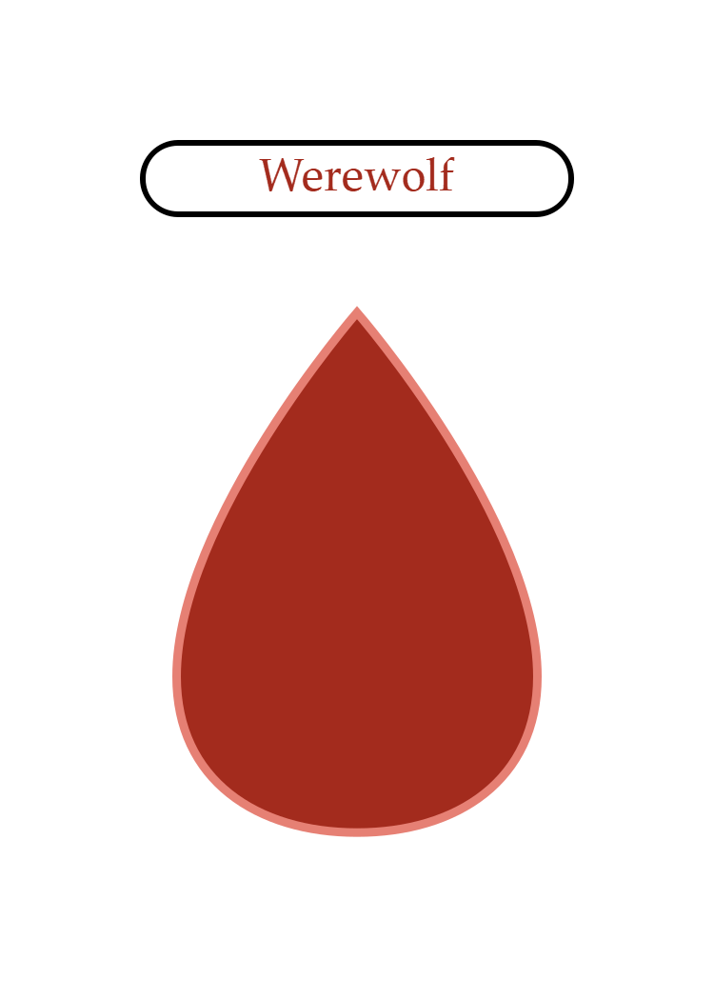

# Example

In this file we'll walk thru the example layout provided with brikWork called `werewolf.bwl` that makes role cards for a seven player game of the well known game Werewolf. After that we'll look at running brikWork, and what the final generated assets look like

## The Layout File
Let's look at the layout file one section at a time

### `[layout]` section

    [layout]
    width = 2.5in
    height = 3.5in
The size of the asset, in this case the size of a standard US poker card

    name = [role][repeatIndex].png
The name of the asset, `[role]` is pulled from the data, and `[repeatIndex]` is a builtin brik the returns the number of times the current row has been repeated, starting with one

    output = out/
The folder we want the assets put into. All file paths are relative to the layout file, so in this case a folder called "out" in the same place as the layout file

### `[names]` section

    [names]
    bloodRed = #a32b1d
    #maybe a little dark, but readability is important
A custom color name, as a hex code, we use this later as a brik. Also a comment ot remark on the color

### `[titleBorder]` element

    [titleBorder]
A unique name for the element
    
    type = rect
The type of this element. This is the only required property for elements and it's recomended to put it first

    x = center
    y = .5in
The location of the element. This element is centerd left-to-right

    width = 1.5in
    height = .25in
The size of the element

    lineWidth = 6
The line to draw the shape with in pixels

    xRadius = .125in
    yRadius = .125in
The rounding of the corners

### `[title]` element

    [title]
    type = label
    x = center
    y = .5in
    width = 1.5in
    height = .25in
There's nothing too different from the element above. Note that the size and location is the same as its border

    text = [capitalize| [role] ]
The text we want in the label. Here we want a capitalized version of whatever is in the role column of the data this row

    color = [if| [eq| [role] | werewolf ] | [bloodRed] | black ]
The color of the text, if this is a werewolf row we want the color to be the color we defined in the `[names]` section defined earlier, otherwise we want black

    alignment = center middle
The text alignment. Because we made the label and border the same size, we put the text right in the center to give some room around the border

    fontSize = 36
    fontFamily = Palatino Lintotype
Font settings, Palatino Linotype at 36 pt

### `[icon]` element

    [icon]
    type = image
    x = center
    y = 1in
    source = images/[role].png
The image file is specified with a brik, otherwise not much to see here

### `[data]` section

    [data]
    repeat, role
    2, werewolf
    4, villager
    1, seer
The data the assets are based on. The repeat column tells the engine how many times we want to generate an asset from this row. The name column turns into the brik `[role]` that you've been seeing in the example

## Running Brikwork
Currently, the recomended way of running brikWork is to set it as the default opener for .bwl files. We can do this by right clicking a layout and selecting "Open with". This will open up a dialog that shows us a list of apps. Windows doesn't know about brikWork yet so we select "More apps ↓", scroll all the way down and select "Look for another app on this PC". This will bring up a file select dialog. Navigate over to where you unzipped the brikWork package and select "brikWork.exe". Doing this will run brikWork and generate the assets, putting them in a folder called "out" in the same folder as "werewolf.bwl". This also makes brikWork run everytime you double click a .bwl file

Alternatively, layout files can be dragged and dropped on to brikWork.exe.

## Output
After running brikWork the generated assets will be in the location specified by the `output` property of the layout section with names as defined by the `name` property of the layout section. In this case the "out" folder with names like "werewolf2.png" and "seer1.png". Lets look at what these cards look like

___

___

___

Now you're ready to make your own layouts and generate your own assets, look at [Syntax](Syntax.md) for more about how the layout files are parsed, or [Layout and Elements](Layout-and-Elements.md) for more about what properties are available
