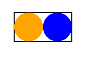

# Syntax
brikWork technically uses 3 different parsers at different points of generating assets, each with it's own quirks.

## Layout File Parser

The basic structure of the layout file is of a series of sections. Sections consist of a name followed by contents enclosed in curly braces, for example
```
layout {
    width: 2.5in
}
```
Different sections can feature different contents. The standard type of contents is a series of property definitions, which feature a property name, a colon, and a value, and are ended by a semicolon, the end of the line, or the end of the section.
```
    fontSize: 36pt
    italic: yes; bold: yes;
    underline: no}
```
The indentation is not required but reccomended for readability. There are two kinds of sections, special sections that control the operation of the engine and element sections that describe elements that become the asset.

## Special Sections

There are 5 special sections.

The `layout` section specifies the size of the final asset as well as interactions with the file system. This section uses property definitions. A full list of properties available to the `layout` section are listed in [Properties](../Properties/).

The `data` section specifies data used in generating assets. This section uses the CSV syntax described [below](#csv-syntax).

The `briks` section specifies briks available to the user. The contents of this section use a syntax similar to variable definitions in other languages. A description of briks is [below](#brik-syntax). Like property definitions, brik definitions end with a semicolon, a new line, or the end of the section just like property definitions.
```
briks {
    heliotrope = #DF73FF
}
...
    fillColor: [heliotrope]
```

The `defaults` section specifies defaults for element properties, and uses the same property definition syntax.
```
defaults {
    fontFamily: Times New Roman
    
}
```

The `pdf` section dictates that a pdf whould be generated from the assets instead of individual images. This section uses property definitions. A layout file needs at least an empty section to generate the pdf, as in

    pdf {}

Assets are laid out an asset at a time starting from the upper left of the page, going across to the right, then the next row is started. The total usable area of the page determines how many assets can fit onto a page, eg a letter sized page with the default quarter inch margins will have a usable space of 8 inches across and 10.5 inches down, which is enough space for 9 poker or bridge size cards in portrait. A full list of properties available to the `pdf` section are listed in [Properties](../Properties/)

## Element Sections

Element sections describe the text, images, and shapes that make the final asset. Element sections must have unique names and those names can't be the names of the special sections, nor can they contain any special characters, like a colon or curly braces, spaces are okay. Elements can also conain other elements, which are positioned realative to their container.
```
#some properties omitted for clarity
infoBox {
    type: rect
    width: 1in
    height: .5in
    ...

    attackBG {
        type: circle
        width: .5in
        ...
    }
    defenceBG {
        type: circle
        x: .5in
        width: .5in
        ...
    }
}
```


### Whitespace

Whitespace is largly ignored, the rule of thumb being whitespace on boundries is removed. In a property definition such as `text: NOW that's what I call tokens     ;` the property name is "text" and the value is "NOW that's what I call tokens". When whitespace is meaningful it is called out in the description of that syntax.

### Comments

A comment is a line that starts with a pound sign after any indent. Everything after the pound sign `#` is ignored until the end of the line.

## Brik Syntax

Briks are the programming utility of brikWork, as well as its namesake. Briks are used in values and are surrounded by square brackets `[ ]`. A brik returns a value, either as a variable brik like `[repeatIndex]` or as a function brik like `[capitalize| ]`. Variable briks include column briks which pull values from the data, and user briks  which are defined in the `briks` section. The act of turning a brik into a value is called evaluation. For a full list of briks provided by brikWork see [Briks](../Briks/).

Function briks have extra syntax over variable briks in the form of arguments. Arguments are values that are used by the brik in order to create the final returned value. The brik name and arguments are separated by vertical bars `|`. Brik arguments are evalutated as part of evalutating the brik, and if the birk returns a value that contains briks they too will be evaluated.

### Escapes

An escape is a means of preventing a part of a value from being evaluated, it "escapes" the parser. brikWork uses the common idiom of using the back slash `\` as the escape character, with any character after it not having any special value, this can be used to put square brackets in your value without them being evaluated as briks, or to put spaces at the edge of a value. Escapes known to brikWork are

Escape | Meaning | Escape | Meaning
------ | ------- | ------ | -------
`\n` | a new line | `\s` | a space
`\t` | a tab | `\\` | a literal backslash

Anything else has it's back slash removed and put into the final value. Because escapes are the last thing evaluated something like `\[new\]` won't be evaluated as a brik and instead will be "[new]" in the asset.

## CSV Syntax

brikWork uses comma seperated values for data. CSV is a common format with many dialects, this description is for the dialect used by brikWork.
Values are separated with commans, and like with colons seperating properties and values, any whitespace that touches the comma is removed. The first row is used as names for column briks. Commas can be escaped to be included in the data with `\,`. Blank headers are not allowed, but blank values are. If a row doesn't provide values for all the columns those columns will be assigned a blank value.

    colorLeft, colorCenter,, colorRight
    red, blue, yellow
    black, , white
    , purple
    orange, green
This example creates three briks, `[colorLeft]`, `[colorCenter]`, and `[colorRight]`, and four assets out of the values

 - "red", "blue", and "yellow"
 - "black",  "", and "white"
 - "",  "purple", and ""
 - "orange",  "green", and ""


A layout file does not need any data. If both the `data` property in the `layout` section and the `data` section are not used, only one asset will be generated, and no column blocks will be available. Data is also considered blank if there are fewer than two lines.

A column with the name `repeat` acts as a special column. When a row's repeat value is more than one, multiple assets are generated from that row, each evaluated on their own, each counted as their own asset. A repeat column is not required.

brikWork builds the layout from the above sections, then for each row in the data, a new asset is generated by evaluating all the properties of all the elements, with the column briks set to the values in the same column of the current row.
