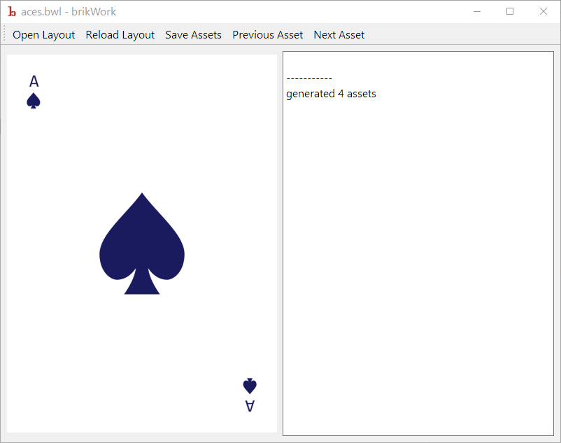

# Using brikWork
brikWork provides a small gui that generates and previews assets, and has a text log to present errors to the user.

## Installation

brikWork doesn't need to be installed, just unzip all the contents of the release folder into a useful place, like `Documents\brikWork` and use it from there.

## Usage
brikWork cen either be used directly or you can set it to be the default program to open ".bwl" files, which is the extension used for layout files. After that just double click a layout file and brikWork wil open in in the preview.

brikWork is also usable from the command line, give brikWork filename to open and the `--windowless` command line flag and brikWork will open the file, generate the assets, and save them to the folder specified in the `output` layout property.